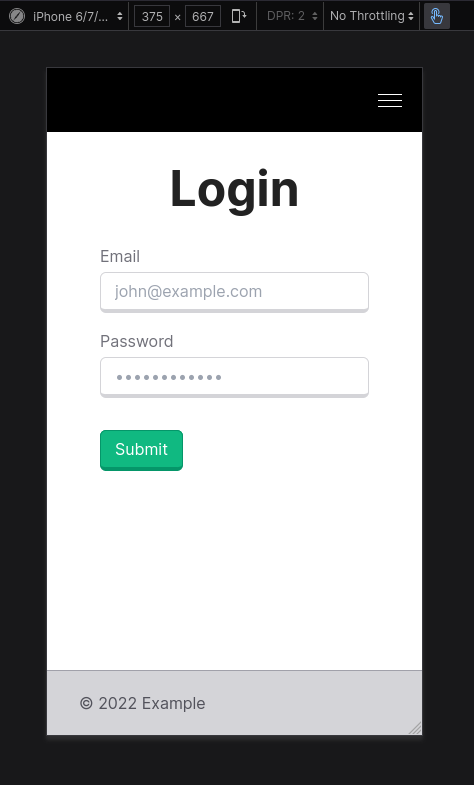

# Cromwell Tools - Digital Node Test

## Contents

- [Installation](#installation)
- [Features](#features)
  - [Pages](#pages)
  - [REST API](#rest-api)
  - [Redux](#redux)
  - [Database](#database)
  - [Validation](#validation)
  - [JWT](#jwt)
  - [Docker](#docker)
  - [Responsive](#responsive)

## Installation

`npm install`

`npm run dev`

or

`npm install`

`npm run build`

`npm run start`

Try it out at: https://cromwell.adamjones.io

## Features

### Pages

- Home page: `/`
- Registration page: `/register`
- Login page: `/login`
- Landing page: `/landing` (inaccessible until logged in)

### REST API

| Name         | Description                                     | Method | Endpoint         |
| ------------ | ----------------------------------------------- | ------ | ---------------- |
| Login        | Logs the user in and sets a token cookie        | POST   | `/user/login`    |
| Registration | Create an account for the user                  | POST   | `/user/register` |
| Logout       | Logs the user out and unsets their token cookie | GET    | `/user/logout`   |
| User         | Retrieves and returns the user's data           | GET    | `/user`          |

### Redux

Redux Toolkit is used throughout the app, such as for the "toast" notification. This allows any page or component to activate the toast notification and set its message and variant.

### Database

SQLite is used for the database. The Prisma ORM library is used to interface with the database.

Use `npm prisma studio` to view the database in your browser.

### Validation

Frontend validation is implemented using HTML form properties such as `required` and `minlength`.

Backend validation is implemented by manually checking the data to ensure it really is valid.

### JWT

JWTs are used to store user data and for authentication.

The secret key used to sign tokens is stored in an environment variable in .env.local (in a real application this file wouldn't be uploaded to GitHub).

JWTs are stored in an HTTP-Only cookie, meaning that client-side scripts cannot access it. This mitigates the risk of XSS attacks.

### Docker

Use the following commands to build and run the application as a Docker container.

`sudo docker build -t cromwell-test .`

`sudo docker run -p 8080:3000 cromwell-test:latest`

### Responsive

All pages are fully mobile-friendly.

